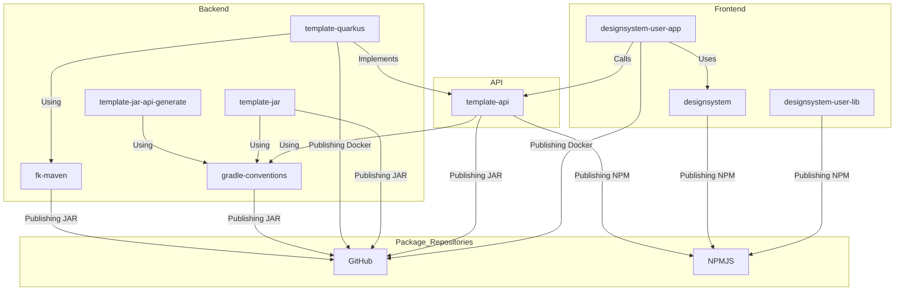

## Overview

This is a quick overview of how we build software.

- Frontend
  - [designsystem](https://github.com/Forsakringskassan/designsystem) - Försäkringskassans Designsystem.
    - Publishing to [NPMJS](https://www.npmjs.com/org/forsakringskassan).
  - [designsystem-user-app](https://github.com/Forsakringskassan/designsystem-user-app) - Example frontend application using [designsystem](https://github.com/Forsakringskassan/designsystem).
    - Integrates with [template-quarkus](https://github.com/Forsakringskassan/template-quarkus) using client from [template-api](https://github.com/Forsakringskassan/template-api) via [NPMJS](https://www.npmjs.com/org/forsakringskassan).
  - [designsystem-user-lib](https://github.com/Forsakringskassan/designsystem-user-lib) - Example NPM library using our toolchain via [NPMJS](https://www.npmjs.com/org/forsakringskassan).
- API
  - [template-api](https://github.com/Forsakringskassan/template-api) - Example API that publishes spec and any frontend/backend generated code to [repository](https://github.com/Forsakringskassan/repository).
    - Using [gradle-conventions](https://github.com/Forsakringskassan/fk-maven) via [repository](https://github.com/Forsakringskassan/repository).
- Backend
  - [fk-maven](https://github.com/Forsakringskassan/fk-maven) - Parent POM:s to use with Maven to apply our code standard and other things.
    - Publishing to [repository](https://github.com/Forsakringskassan/repository).
  - [gradle-conventions](https://github.com/Forsakringskassan/gradle-conventions) - Precompiled script plugins to use with Gradle to apply our code standard and other things.
    - Publishing to [repository](https://github.com/Forsakringskassan/repository).
  - [template-quarkus](https://github.com/Forsakringskassan/template-quarkus) - Example Quarkus application using our toolchain.
    - Using [fk-maven](https://github.com/Forsakringskassan/fk-maven) via [repository](https://github.com/Forsakringskassan/repository).
    - Implements `jaxrs-spec` generated by [template-api](https://github.com/Forsakringskassan/template-api).
    - May call other backend apps by creating a client with [jaxrs-client-factory](https://github.com/Forsakringskassan/jaxrs-client-factory) together with `jaxrs-spec` from [api](https://github.com/Forsakringskassan/template-api) or by generating `jaxrs-spec` like [template-jar-api-generate](https://github.com/Forsakringskassan/template-jar-api-generate).
  - [template-jar](https://github.com/Forsakringskassan/template-jar) - Example JAR library using our toolchain.
    - Publishing to [repository](https://github.com/Forsakringskassan/repository).
    - Using [gradle-conventions](https://github.com/Forsakringskassan/fk-maven) via [repository](https://github.com/Forsakringskassan/repository).
  - [template-jar-api-generate](https://github.com/Forsakringskassan/template-jar-api-generate) - Example showing how to generate code from OpenAPI that is fetched from [repository](https://github.com/Forsakringskassan/repository).
    - Using [gradle-conventions](https://github.com/Forsakringskassan/fk-maven) via [repository](https://github.com/Forsakringskassan/repository).

